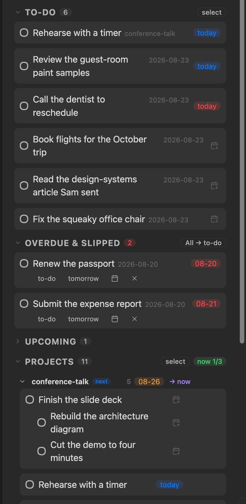
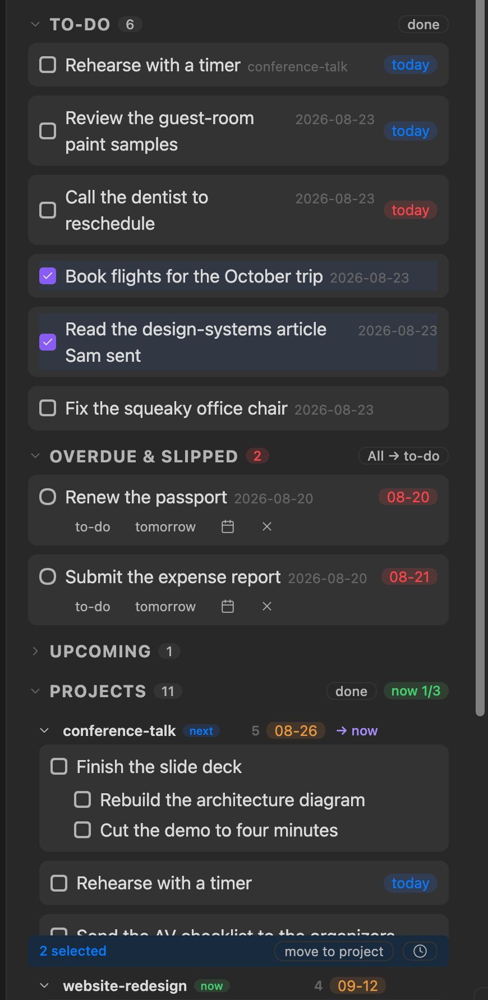
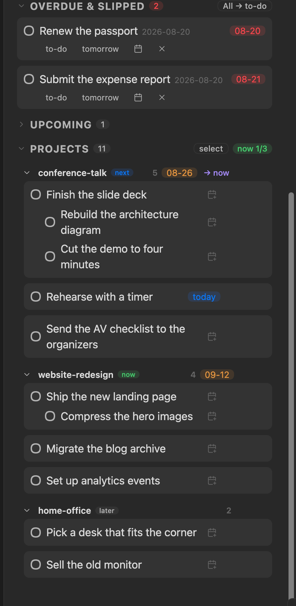

# Taskflow

An Obsidian sidebar panel that turns daily-note capture into project execution. Your markdown is the database; the panel is a projection of it — Taskflow keeps no task store of its own, mints no IDs, and edits a task line only when you act on it. Every action is a plain text edit you could have made yourself, and every panel action has an undo.

> **Alpha** — Taskflow is in friends-and-family testing ahead of a community-directory submission. Issues and feedback very welcome.



## Install (alpha)

Taskflow isn't in the community directory yet. Two ways in:

- **BRAT** (recommended): install the [BRAT](https://github.com/TfTHacker/obsidian42-brat) plugin, then *Add beta plugin* → `SeanYHan888/obsidian-taskflow`. BRAT keeps you on the latest release.
- **Manual**: download `main.js`, `manifest.json`, and `styles.css` from the [latest release](https://github.com/SeanYHan888/obsidian-taskflow/releases), put them in `<your vault>/.obsidian/plugins/taskflow/`, reload Obsidian, and enable Taskflow in *Settings → Community plugins*.

**Requirements:** Obsidian 1.7.2+ and the [Tasks](https://github.com/obsidian-tasks-group/obsidian-tasks) plugin in its default emoji format. Taskflow reads tasks through Tasks and completes them through its API, so done-dates, recurrence, and any downstream sync keep working. Without it, the panel tells you what's missing instead of rendering.

## 60-second start

1. Install and enable **Tasks**, then **Taskflow**. The panel opens in the right sidebar (or run the *Open panel* command).
2. Put `- [ ] try Taskflow ⏳ 2026-08-24` (today's date) in any note → it appears in **To-do**.
3. Enable the core **Daily Notes** plugin and add an `# Inbox` heading to today's note. Any task you jot under it shows up at the tail of To-do, waiting for triage.
4. When you're ready for projects: create a `Projects/Active` folder and give each project note a `status: now|next|later` frontmatter field. (Or skip this — Taskflow works fine as a pure daily-note panel, and the Projects section will explain the workflow when you want it.)

## The model

Tasks are checkbox lines in the [Tasks emoji format](https://publish.obsidian.md/tasks/Reference/Task+Formats/Tasks+Emoji+Format):

- `⏳` **scheduled** — the day you *plan* to work on it. Slideable without guilt; the only date most tasks ever need.
- `📅` **due** — a real external deadline. Rare, and always a debt once it arrives.
- A task belongs to a project because its line lives in that project's note. No project tags.
- **Triage** means emptying the inbox: give each capture a date, a project, or a cancellation.

The panel is four projections of that model:

| Section | What's in it |
|---|---|
| **To-do** | Open tasks scheduled or due **today**, then your undated inbox captures — the day's list and its triage queue, one working surface. |
| **Overdue & slipped** | Tasks due before today, or scheduled before today. A repair queue, not a guilt list. |
| **Upcoming** | Tasks dated later, visible while they wait, so scheduling ahead never makes a task disappear. Collapsed by default. |
| **Projects** | The open tasks in each project note, grouped by project, paced by your pacing mode (below). |

Sections are disjoint views of one thing — the date on the line. Tasks never "move" between them except by date edits or the passage of days.

## Working the panel

**Rows.** The circle completes a task (through the Tasks API, so ✅ done-dates are written). Clicking the text jumps to the task's line in its note — `Cmd/Ctrl+click` opens in a new tab, middle-click too. **Right-click any row** for everything at once: open in note, the quick dates, and cancel.

**Date chips.** Click a task's chip (or the small calendar button on an undated row) for the quick-date menu: *To-do (today) · Tomorrow · Weekend · Pick a date…*, plus *Remove date* when there's a plan to withdraw. Chips are amber while a date is ahead and red once it has arrived.

**Repairing slipped tasks.** Rows in Overdue & slipped carry one-tap actions: *to-do*, *tomorrow*, pick a date, or cancel. The section header's *All → to-do* sweeps everything slipped onto today's list — the morning zero ritual.

**Drag and drop** (desktop). Drag any row onto the **To-do** header to schedule it today, onto **Upcoming** to pick a future date, or onto a **project** to move the line (with its subtasks) into that note. Only targets whose drop would actually do something light up.

**Bulk triage.** Hit *select* on the To-do or Projects header (or just start selecting) — checkboxes appear across the working list and the backlogs. A bar at the panel's foot shows the count with *move to project* and bulk scheduling. `Esc` exits.



**Move to project** physically cuts the task lines — subtask children included — out of their source and appends them under your project note's `## Tasks` heading (configurable). Choose *+ New project…* in the picker and Taskflow creates the note for you, from your template if you set one, from a minimal built-in scaffold if not. **Send back to inbox** (on a backlog task's menu) is the inverse: the line returns to today's daily note under your inbox heading.

**Undo.** Every line edit — reschedules, cancels, moves, bulk sweeps — shows a notice with an *Undo* link, and the *Undo last panel action* command replays the journal backwards. Undo verifies each line still reads what the action left before restoring it; anything you've edited since is skipped, never guessed at.

## Projects and pacing

A project is a note in your projects folder with frontmatter:

```yaml
---
status: next        # now | next | later
deadline: 2026-08-26  # optional, ISO date
---
```

Fold a project group by clicking its header; the hover `↗` (or `Cmd/Ctrl+click`) jumps to the note. Right-click the header (or the `…` button) for the lifecycle menu: set status, set or clear the deadline, and *Mark done / dropped & archive*, which stamps the terminal status and moves the note to your archive folder — task lines untouched, links intact.



**Pick your pacing** in settings:

- **Capacity** — a `now n/limit` badge counts projects in `now` against your work-in-progress limit. Red past the limit; warns, never blocks.
- **Deadlines** — projects carry deadline chips and sort soonest-first; the badge stays out of the way.

In every mode you can also arrange the list by hand: the project header's menu has Move to top / up / down / to bottom, or on desktop drag a header onto another (stored as an `order` number in the note's frontmatter), setting a project to `now` lifts it to the top, and the Backlogs menu's **Organize by status** regroups everything now → next → later. A deadline that has arrived always leads.
- **Hybrid** (default) — both signals, plus the **pressing loop**: when a project's deadline is within the attention window (7 days by default) but the project isn't in `now`, its header offers a one-tap **→ now**. Your calendar and your commitments disagree — one tap answers, ignoring it is also an answer. Promoting past your limit goes through, and the notice names it: *"conference-talk → now — now is full (4/3)"*.

Switching modes is lossless: statuses and deadlines live in your notes' frontmatter, not in the plugin.

## Settings

| Setting | Meaning | Default |
|---|---|---|
| Daily notes folder | Fallback when the core Daily Notes plugin is off — otherwise its configured folder is used automatically | `Daily Notes` |
| Projects folder | Notes here are projects | `Projects/Active` |
| Archive folder | Where retired project notes go | `Projects/Archive` |
| Machine-managed note | Optional — see below | *(blank)* |
| Inbox heading | The daily-note heading that counts as capture (plain text match, any language) | `Inbox` |
| Project template | Optional note for *New project…*; `{{title}}` and `{{date:YYYY-MM-DD}}` are filled in | *(built-in scaffold)* |
| Move-target heading | Where moved tasks land in a project note | `Tasks` |
| Project pacing | Capacity / Deadlines / Hybrid | Hybrid |
| Work-in-progress limit | Projects allowed in `now` before the badge warns | `3` |
| Deadline attention window | Days before a deadline that hybrid offers `→ now` (0 = on arrival) | `7` |

**Machine-managed note:** if some tool rewrites a note in your vault on its own schedule (an Apple Reminders sync, for example), point this setting at it. Its dated reminders appear and nag like any task, its scheduled time-blocks stay hidden (they're calendar, not tasks), and its rows allow check-off only — so the next sync never clobbers a panel edit.

## Playing well with others

Taskflow interoperates through shared markdown, not APIs:

- **Tasks** owns parsing and completion side effects — Taskflow never invents its own task format.
- **Day Planner** owns time: daily-note `# Events:` sections are never read or written.
- **Kanban**: the move-target heading is configurable, so a project note that becomes a board keeps receiving triaged tasks.
- **Sync tools**: the machine-managed note setting is the generic contract for any note-rewriting tool.

## Credits

Taskflow began as a fork of [obsidian-checklist-plugin](https://github.com/delashum/obsidian-checklist-plugin) by delashum, whose minimalist card-list look it keeps. MIT licensed; original license retained.
